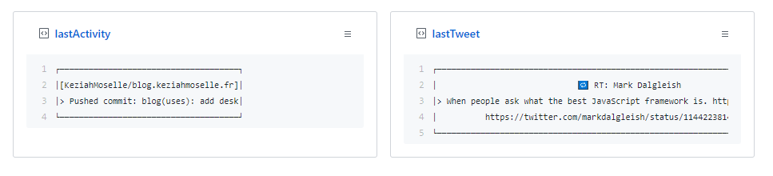

# showcase-gists
Showcase Gists on your profile

## Goal of this project

The goal of this project is to create **dynamic** fun/useful Gists and pin them on your profile.

## How it works

The entry file will determined which jobs you want to add : 
```js
// Jobs to load
const jobs = [
  'lastActivity', // Last GitHub activity
  'lastTweet', // Last tweet
  'WakaTime' // Total hours of coding
]
```

for example "lastActivity" will fetch the last GitHub activity, format the content and create or update the Gist.

## Run the project

- `npm install`
- Comment or uncomment the jobs you want i.e :
  ```js
  // src/index.js
  const jobs = [
    'lastActivity', <-- Just want the last GitHub activity
    //'lastTweet',
    //'WakaTime
  ]
  ```
- You will need the following environment variables (see .env.example) :
  - a GitHub `PERSONAL_ACCESS_TOKEN` with the gist scope (**required**)
  - `GITHUB_USERNAME` (**required**)

Additionals jobs may require other environment variables.

### Output


